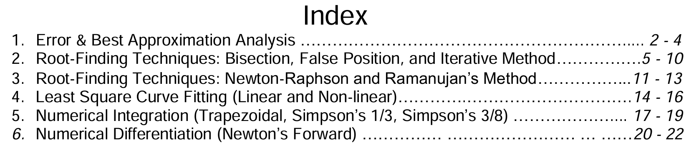

# CSE-2204 (Numerical Analysis)

Welcome to the **CSE-2204** GitHub repository! This repository is a comprehensive resource for students of RUET having CSE 2204 course. Below is an organized index of its contents for ease of navigation.  

---

## Table of Contents

### **Contact**
   - Author: [kefaet03](https://github.com/kefaet03)  
   - For queries, open an issue or contact via the GitHub profile.

---

Feel free to explore and contribute to the repository! For any clarifications, refer to the [issues](https://github.com/kefaet03/CSE-2202/issues) section or reach out directly.
